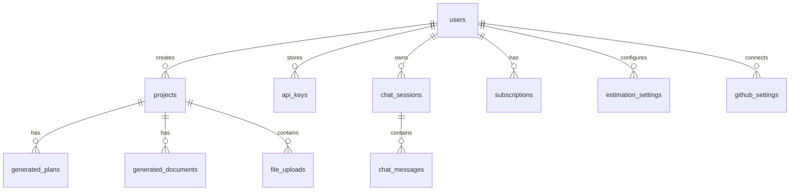

# AID Kitty — Database Schema

## Overview

AID Kitty uses **PostgreSQL** with **Drizzle ORM**. Migrations are defined in `/migrations/` and run automatically on server startup via `runMigrations()`.

## Schema Location

- Schema definition: [`shared/schema.ts`](../shared/schema.ts)
- Migration files: [`migrations/`](../migrations/)
- Drizzle config: [`drizzle.config.ts`](../drizzle.config.ts)

## Tables

### Core Tables

#### `users`
| Column | Type | Notes |
|:---|:---|:---|
| `id` | text (UUID) | Primary key, auto-generated |
| `email` | text | Unique, required |
| `password` | text | bcrypt hash (nullable for SSO users) |
| `name` | text | Display name |
| `microsoftId` | text | Microsoft Entra ID object ID |
| `tenantId` | text | Azure AD tenant ID |
| `authProvider` | text | `'local'` or `'microsoft'` |
| `createdAt` | timestamp | Auto-set |

#### `projects`
| Column | Type | Notes |
|:---|:---|:---|
| `id` | text (UUID) | Primary key |
| `userId` | text | FK → users.id |
| `title` | text | Project name |
| `description` | text | Project description |
| `status` | text | `'active'`, `'completed'`, `'archived'` |
| `createdAt` | timestamp | Auto-set |
| `updatedAt` | timestamp | Auto-set |

### AI Generation Tables

#### `generated_plans`
| Column | Type | Notes |
|:---|:---|:---|
| `id` | text (UUID) | Primary key |
| `projectId` | text | FK → projects.id |
| `userId` | text | FK → users.id |
| `content` | text | Generated plan content (markdown) |
| `provider` | text | AI provider used (e.g., `'openai'`) |
| `model` | text | Model name (e.g., `'gpt-4o'`) |
| `tokensUsed` | integer | Tokens consumed |
| `generationTime` | real | Seconds to generate |
| `createdAt` | timestamp | Auto-set |

#### `generated_documents`
| Column | Type | Notes |
|:---|:---|:---|
| `id` | text (UUID) | Primary key |
| `projectId` | text | FK → projects.id |
| `userId` | text | FK → users.id |
| `title` | text | Document title |
| `documentType` | text | `'prd'`, `'spec'`, `'architecture'`, etc. |
| `content` | text | Generated content (markdown) |
| `status` | text | `'draft'`, `'final'` |
| `provider` | text | AI provider used |
| `createdAt` | timestamp | Auto-set |

### Chat Tables

#### `chat_sessions`
| Column | Type | Notes |
|:---|:---|:---|
| `id` | text (UUID) | Primary key |
| `userId` | text | FK → users.id |
| `title` | text | Session title |
| `projectId` | text | Optional FK → projects.id |
| `createdAt` | timestamp | Auto-set |
| `updatedAt` | timestamp | Auto-set |

#### `chat_messages`
| Column | Type | Notes |
|:---|:---|:---|
| `id` | text (UUID) | Primary key |
| `sessionId` | text | FK → chat_sessions.id |
| `role` | text | `'user'` or `'assistant'` |
| `content` | text | Message content |
| `provider` | text | AI provider used |
| `tokensUsed` | integer | Tokens consumed |
| `createdAt` | timestamp | Auto-set |

#### `chat_templates`
| Column | Type | Notes |
|:---|:---|:---|
| `id` | text (UUID) | Primary key |
| `name` | text | Template name |
| `content` | text | Template prompt |
| `category` | text | `'technical'`, `'business'`, etc. |
| `userId` | text | FK → users.id |
| `isSystem` | boolean | System vs user template |
| `createdAt` | timestamp | Auto-set |

### Configuration Tables

#### `api_keys`
| Column | Type | Notes |
|:---|:---|:---|
| `id` | text (UUID) | Primary key |
| `userId` | text | FK → users.id, unique per provider |
| `provider` | text | `'openai'`, `'anthropic'`, etc. |
| `apiKey` | text | Encrypted API key |
| `createdAt` | timestamp | Auto-set |

#### `estimation_settings`
Stores function point estimation parameters per user.

#### `prompt_templates`
System-level prompt templates seeded on first startup.

#### `prompt_builder_sessions`
Stores prompt builder workspace state.

### Integration Tables

#### `github_settings`
| Column | Type | Notes |
|:---|:---|:---|
| `id` | text (UUID) | Primary key |
| `userId` | text | FK → users.id |
| `accessToken` | text | GitHub access token |

#### `openhands_settings` / `openhands_builds`
Configuration and build tracking for OpenHands integration.

#### `subscriptions`
| Column | Type | Notes |
|:---|:---|:---|
| `id` | text (UUID) | Primary key |
| `userId` | text | FK → users.id |
| `microsoftSubscriptionId` | text | AppSource subscription ID |
| `planId` | text | Marketplace plan |
| `status` | text | `'active'`, `'suspended'`, `'cancelled'` |
| `createdAt` | timestamp | Auto-set |

### `file_uploads`
| Column | Type | Notes |
|:---|:---|:---|
| `id` | text (UUID) | Primary key |
| `projectId` | text | FK → projects.id |
| `userId` | text | FK → users.id |
| `filename` | text | Original filename |
| `filepath` | text | Server storage path |
| `mimetype` | text | MIME type |
| `size` | integer | File size in bytes |
| `createdAt` | timestamp | Auto-set |

## Running Migrations

```bash
# Migrations run automatically on server startup

# Manual migration (if needed)
npx drizzle-kit migrate

# Generate new migration after schema changes
npx drizzle-kit generate

# Seed prompt templates
npx tsx server/seed-prompt-templates.ts
```

## Entity Relationship Diagram


